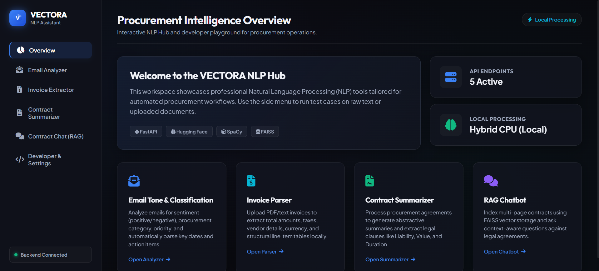
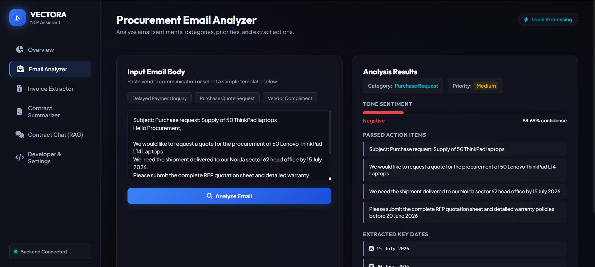
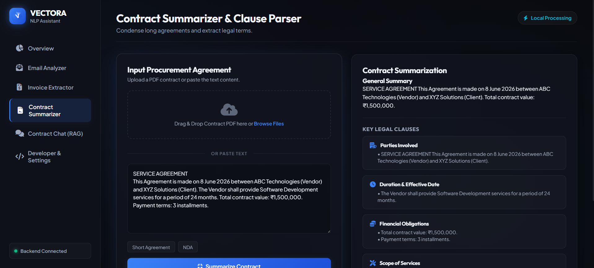
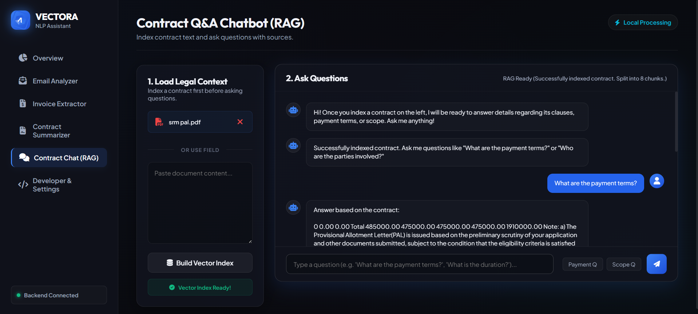

# AI Procurement Assistant

An AI-powered procurement automation platform developed during the BPAAS Internship. The application helps procurement teams automate email analysis, invoice data extraction, contract summarization, and intelligent contract question-answering using Natural Language Processing (NLP) and Retrieval-Augmented Generation (RAG).

---

## Live Demo

**Live Demo URL:** [nlp-assistant-vectora.vercel.app]

---

## Features

### 1. Email Analyzer

Analyze procurement-related emails and automatically identify:

* Sentiment (Positive, Negative, Neutral)
* Priority Level
* Procurement Category
* Action Items
* Important Dates

#### Example Output

* Sentiment: Negative
* Category: Payment Issue
* Priority: High
* Action Item: Resolve delayed payment

---

### 2. Invoice Data Extraction

Extract structured information from:

* PDF invoices
* Text invoices

Detected fields include:

* Invoice Number
* Vendor Name
* Invoice Date
* Due Date
* Total Amount
* GST Information

---

### 3. Contract Summarizer

Generate concise contract summaries and identify key clauses:

* Parties Involved
* Contract Duration
* Financial Obligations
* Scope of Services
* Termination Conditions
* Dispute Resolution

Supports both:

* PDF Contracts
* Plain Text Contracts

---

### 4. AI Contract Chatbot (RAG)

Upload and index a contract, then ask questions such as:

* What is the payment schedule?
* What are the termination conditions?
* Is there a penalty clause?
* What are the vendor responsibilities?

The chatbot performs semantic search over contract content and returns the most relevant contract clauses.

---

## Technology Stack

### Frontend

* HTML5
* CSS3
* JavaScript

### Backend

* FastAPI
* Python

### NLP & AI

* Sentence Transformers
* FAISS
* Transformers
* spaCy
* PDFPlumber

### Deployment

* Vercel (Frontend)
* Railway (Backend)

---

## System Architecture

User Uploads Document -> Document Processing Layer -> NLP Extraction Pipeline -> Vector Database & Retrieval -> Semantic Search Engine -> Business Intelligence Layer -> Interactive User Interface

---

## Screenshots

### Dashboard

### Email Analyzer

### Invoice Extraction

### Contract Summarization

### RAG Contract Chatbot

---

## Author

**Pratistha Chaira**